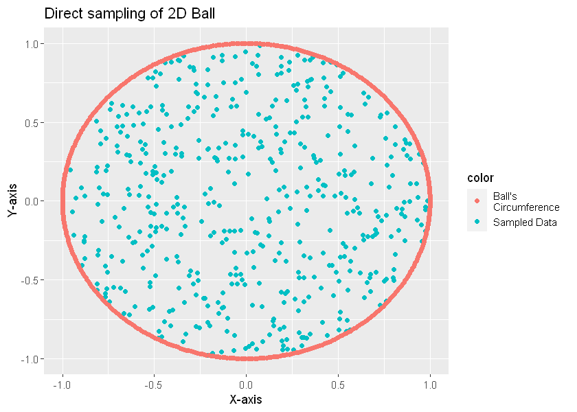
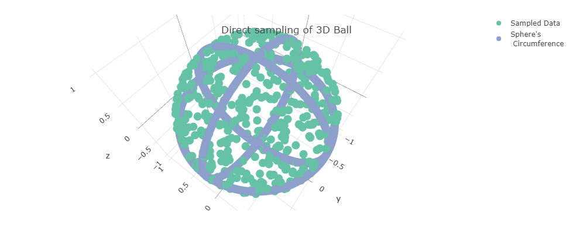
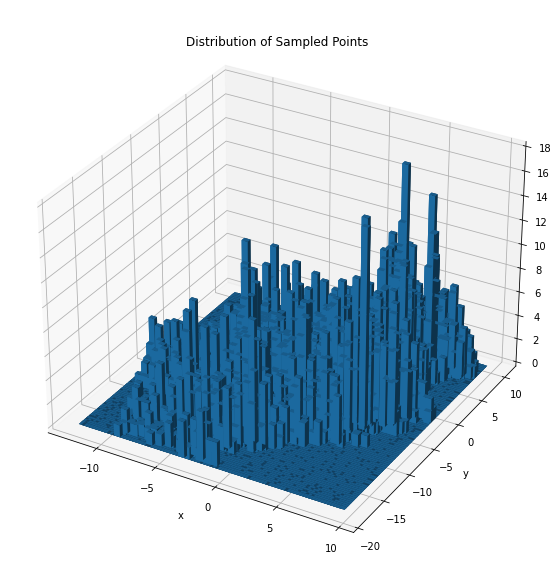

# Visualize sampling in a polytope by using volesti library

### Sampling and Visualize a 2D Ball polytope


```R
options(warn=-1)
suppressMessages(library(volesti))
suppressMessages(library(ggplot2))
suppressMessages(library(gridExtra))
suppressMessages(library(plotly))


#sample 500 points of a 2D-ball polytope
points = direct_sampling(n = 500, body = list("type" = "ball", "dimension" = 2))
sampled_data = as.data.frame(t(points))
sampled_data$color = 'Sampled Data'

#Function that returns the Circumference of 2D-Ball
make_2d_ball_circ <- function(center = c(0,0),diameter = 2){
  radius = diameter/2
  circle_points <- seq(0,2*pi,length.out = 500)
  x <- center[1] + radius*cos(circle_points)
  y <- center[2] + radius*sin(circle_points)
  return(data.frame(axis_x = x, axis_y = y))
}
circle = make_2d_ball_circ()
circle$color = 'Ball\'s\nCircumference'

#plot
options(repr.plot.width = 7, repr.plot.height = 5)
p <- (ggplot() + geom_point(data=sampled_data, aes(x = V1, y = V2,colour=color))+
                 geom_point(data=circle, aes(x = axis_x, y = axis_y,colour=color)))
(p+ggtitle("Direct sampling of 2D Ball") +xlab("X-axis") + ylab("Y-axis"))

```





### Sampling and Visualize a 3D Hypersphere polytope


```R
#sample 500 points of a 3D hypersphere polytope
points_3D = direct_sampling(n = 500, body = list("type" = "hypersphere", "dimension" = 3))
sampled_data_3D = as.data.frame(t(points_3D))
sampled_data_3D$color = 'Sampled Data'

#Function that returns the Circumference of 3D-sphere
make_3d_circ <- function(center = c(0,0),diameter = 2,non_dim='z'){
  radius = diameter/2
  circle_points <- seq(0,2*pi,length.out = 500)
  d1 <- center[1] + radius*cos(circle_points)
  d2 <- center[2] + radius*sin(circle_points)
  if(non_dim=='z'){
    return(data.frame(V1 = d1, V2 = d2, V3=0))
  }
  else if(non_dim=='y'){
    return(data.frame(V1 = d1, V2 = 0, V3=d2))
  }
  else{
    return(data.frame(V1 = 0, V2 = d1, V3=d2))
  }
  
}

#Circumferences of all 3 dimensions of the 3D-sphere
cycle_3D = data.frame(matrix(ncol = 3, nrow = 0))
colnames(cycle_3D) <- c("V1", "V2", "V3")
for(d in list('x','y','z')){
  cycle_3D = rbind(cycle_3D,make_3d_circ(non_dim=d))
}
cycle_3D$color = 'Sphere\'s\n Circumference'
#concat data
all_data = rbind(sampled_data_3D,cycle_3D)


#plot
layout(
  plot_ly(x=all_data$V1, y=all_data$V2, z=all_data$V3, type="scatter3d", mode="markers", color = all_data$color),
  title = "\n\nDirect sampling of 3D Ball"
)

```




--------------------------------------------------------------------------------------------------------------------------------------------------------------------------------
# Sample on the flux space of the metabolic network of e_coli

### Use library sybil to read e_coli data and run FBA algorithm


```R
suppressMessages(library(sybil))
options(warn=-1)

mp <- system.file(package = "sybil", "extdata")
mod <- readTSVmod(prefix = "Ec_core", fpath = mp, quoteChar = "\"")
modelorg2tsv(mod, prefix = "Ec_core")
data(Ec_core)
ex <- findExchReact(Ec_core)
optL <- optimizeProb(Ec_core, algorithm = "fba", retOptSol = FALSE)
fba <- optimizeProb(Ec_core, algorithm = "fba")
```

    reading model description, ... OK
    reading metabolite list ... OK
    parsing reaction list ... OK
    GPR mapping ... OK
    sub systems ... OK
    prepare modelorg object ... OK
    validating object ... OK
    


TRUE


    Loading required package: glpkAPI
    using GLPK version 4.47
    

### Extract all constrants in order to define flux space

1. ***S*** :  stoichiometric matrix

2. ***low_bound*** : capacity's lower bound

3. ***up_bound*** : capacity's upper bound


```R
S<- (as.matrix(S(mod)))

low_bound<-mod@lowbnd
up_bound<-mod@uppbnd
```

### Define constrants inequetions

#### Two different constraints make the flux space:

1. ***Sv=0***, where ***S*** is the stoichiometric matrix and ***v*** a unknown vector we are looking for.
2. ***ai<=vi<=bi***, where ***ai*** defined by ***low_bound*** and ***bi*** by ***up_bound***

In oder to represent these constraints we consider the linear inequality ***Ax<=b***. So we construct ***A*** matrix and ***b*** vector.


```R
m = dim(S)[1]
n = dim(S)[2]

up_matrix = diag(n)
low_matrix2 = -1*diag(n)

S2 = -1*S
 
zero_con = numeric(m)+10 #NOTE:                        ***Future Changes**
                         #Inequality contraints we contruct have only one fisible solution equal to zero vector.
                         #      In order to show the whole sampling proccess we change constraint (1) 

A<-rbind(up_matrix,low_matrix2,S,S2)
b<-rbind(t(matrix(up_bound,nrow = 1,ncol = n)),
         t(matrix(-1*low_bound,nrow = 1,ncol = n)),
         t(matrix(zero_con,nrow = 1,ncol = m)),
         t(matrix(zero_con,nrow = 1,ncol = m)))
```

### Polytope's Construction and Sampling

#### A Convex polytope can be described as  ***Ax<=b*** linear inequality.


```R
suppressMessages(library(volesti))
P = Hpolytope(A = A, b = c(b))
sampled_data<-sample_points(P, 10000)
```

### Save sampled data as a csv file


```R
suppressMessages(library(MASS))
current_path = 'C:/Users/petsi/Documents/UOA/Google'
name = '/sampled_data.csv'
full_path=paste(current_path,name,sep='')
write.matrix(sampled_data, file = full_path, sep = ",")
```


--------------------------------------------------------------------------------------------------------------------------------------------------------------------------------

# Plot the distributions of two co-ordinates of sampled points. These points sampled from Flux space of the metabolic network of e_coli


```python
#make the necessary imports
import pandas as pd
import matplotlib.pyplot as plt
import numpy as np
from mpl_toolkits.mplot3d import Axes3D

#full path name of csv file
file_name = 'C:/Users/petsi/Documents/UOA/Google/sampled_data.csv'
df = pd.read_csv(file_name,sep=',',header=None)

#keep only 2 out of 95 dimensions of e-coli reactions
df = df[0:2]
data = df.values

#plot 3D distribution-histogramm of data
fig = plt.figure(figsize=(10, 10))
ax = fig.add_subplot(111,projection='3d')
ax.title.set_text('Distribution of Sampled Points')
ax.set_xlabel('x')
ax.set_ylabel('y')
x, y = data[0], data[1]
nymber_of_bins = 100
minx = np.min(x)
miny = np.min(y)
maxx = np.max(x)
maxy = np.max(y)
hist, xedges, yedges = np.histogram2d(x, y, bins=nymber_of_bins, 
                                      range=[[minx, maxx], [miny, maxy]])

xpos, ypos = np.meshgrid(xedges[:-1] + 0.25, yedges[:-1] + 0.25, indexing="ij")
xpos = xpos.ravel()
ypos = ypos.ravel()
zpos = 0

dx = dy = 0.5 * np.ones_like(zpos)
dz = hist.ravel()

ax.bar3d(xpos, ypos, zpos, dx, dy, dz, zsort='average')

plt.show()
```





--------------------------------------------------------------------------------------------------------------------------------------------------------------------------------


